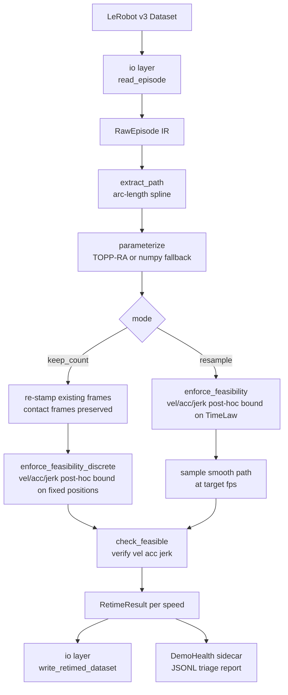

# demoforge

> `black .` for robot demonstrations.

**demoforge** is a CPU-only, deterministic re-timer for [LeRobot](https://github.com/huggingface/lerobot) teleoperation
datasets. It keeps the geometric **path** of each demonstration intact while re-deriving a new **time-law** that respects a
robot's joint velocity / acceleration / jerk limits, then emits a fresh v3-format dataset (the re-timed
action/timestamp parquet layer, optionally replicated at several speeds) plus a per-episode **demo-health** sidecar for triage.

It does *one* thing: turn raw, jerky, inconsistently-paced hand-teleop demos into kinematically clean, dynamically
feasible, jerk-bounded trajectories — offline, reproducibly, on a laptop.

## Architecture



## What it claims (and what it does not)

**demoforge CLAIMS (mechanically verifiable, CPU-only):**

- The re-timed trajectory respects the robot's position / velocity / acceleration / jerk limits
  (violations measured on the emitted discrete trajectory go from *before* > 0 to *after* = 0).
- Jerk is bounded (finite-difference jerk of the emitted trajectory stays under the configured limit).
- The geometric path is preserved within a tolerance ε (Hausdorff distance, joint space).
- Output is deterministic: same input + config ⇒ bit-identical output.
- The health sidecar reports the *before/after transform delta* — it is triage telemetry, not a quality score.

**demoforge does NOT claim:**

- It makes **no claim** about downstream training outcomes. Re-timing is a geometric/kinematic transform; whether a
  re-timed dataset trains a better behaviour-cloning model is unmeasured here and would require GPU policy evaluation.
- It is **not** a dataset quality scorer or an episode ranker
  (see [`score_lerobot_episodes`](https://huggingface.co/RoboticsData/score_lerobot_episodes) for scoring).
- It does **not** assert that a re-timed trajectory will execute on physical hardware or carry across the reality gap.

## Status

`v0.1.0a1` — pre-alpha. API may change.

## Install

Requires Python **3.11+** (the TOPP-RA backend, `toppra`, has no working wheel on 3.10).

```bash
pip install demoforge                 # CPU-only core (numpy/scipy/toppra)
pip install "demoforge[lerobot]"      # optional torch + lerobot (not required for v0.1.0a1 I/O)
pip install "demoforge[urdf]"         # + URDF joint-limit parsing
```

The default re-timing backend is `auto`: it uses TOPP-RA when `toppra` imports and falls back
to a pure-numpy (feasible, not time-optimal) backend otherwise.

## Quickstart

```bash
# Show available joint limit presets (so101, koch, lekiwi)
demoforge limits --robot so101

# Inspect a dataset: report health per episode, no files written
demoforge inspect path/to/dataset --robot so101

# Re-time and emit a new dataset at three speeds + health sidecar
demoforge process path/to/dataset \
    --robot so101 --retime topp \
    --speeds 0.8,1.0,1.2 \
    --preserve-contact gripper \
    --out path/to/dataset_forged \
    --health-out report.jsonl

# Show runtime environment (backends / optional extras)
demoforge doctor
```

## How it works

1. **Strip padding; build the arc-length path** through the recorded waypoints (interpolating cubic spline, so every
   recorded waypoint is preserved as a knot).
2. **Detect contact / dwell segments** on the *raw* signal (before any smoothing) and record them.
3. **Re-derive a feasible time-law** with **TOPP-RA** (Pham & Pham, IEEE T-RO 2018; `toppra`, MIT) under velocity +
   acceleration limits.
4. **Bound jerk post-hoc** by local time-dilation — TOPP-RA has no native jerk constraint, so jerk is bounded by a
   second pass and the whole result is *verified by finite-differencing the emitted trajectory* (vel/acc/jerk all checked).
5. **Emit the re-timed dataset** in one of two modes:
   - **`keep_count`** (default) — keep the recorded positions, frame count and order exactly; only the per-frame
     timestamps change, so the recorded path stays exact and the source video/observations remain valid 1:1 (the writer
     emits the re-timed action/timestamp parquet layer). Contact pacing is never sped below the recording.
   - **`resample`** — sample the smoothed path at a uniform target fps (smooths recording noise; reports the resulting
     path deviation). Each re-timed variant becomes one episode; several speeds can be emitted at once.

## Output modes at a glance

| Mode | Frame count | Path deviation | Video/obs valid 1:1 | Use when |
|---|---|---|---|---|
| `keep_count` (default) | unchanged | 0.0 (exact) | yes | you need the recorded frames to stay aligned |
| `resample` | changes with fps | reported (small) | needs remapping | you want noise-smoothed, uniform-fps output |

## Measured results

Generated by `scripts/gen_readme_numbers.py` from `results/v0.1.0a1.json` (demoforge 0.1.0a1, `mode=synthetic`, so101, 8 episodes, Linux/3.12.3, 2026-05-29).

> Metrics demonstrate geometric/kinematic feasibility of the emitted trajectory only. Mode=synthetic means data is reproducible mock teleop, not a real robot dataset; no claim is made about downstream training outcomes.

| quantity | before | after |
|---|---|---|
| dynamic limit violations (vel/acc/jerk samples) | 1428 | 0 |
| position-box violations (re-timing cannot change these) | 0 | 0 |
| max \|jerk\| (rad/s³) | 2335.067 | 52.936 |

- Path deviation (max joint-space, keep_count mode): **0.0** (positions are preserved exactly; this is 0 by construction in keep_count).
- Deterministic (bit-exact across reruns): **True**.
- Contact/dwell segments flagged and pace-preserved: **186**.

## Bundled robot presets

| Preset | Description |
|---|---|
| `so101` | SO-ARM101 follower: 5-DOF arm + 1 gripper |
| `koch` | Koch v1.1 arm |
| `lekiwi` | LeKiwi mobile manipulator |

Custom limits can be supplied via `--limits path/to/limits.yaml`.

## License

MIT. See [LICENSE](LICENSE).
